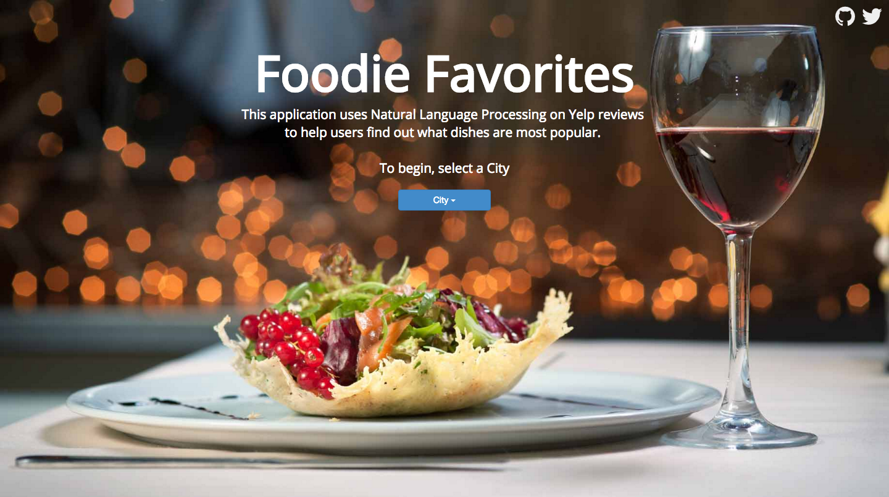
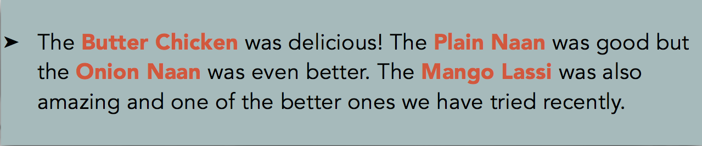
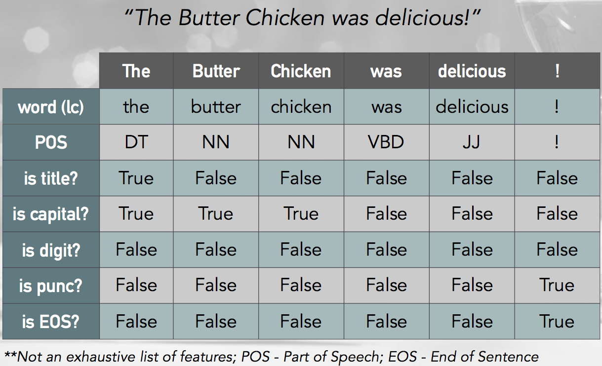
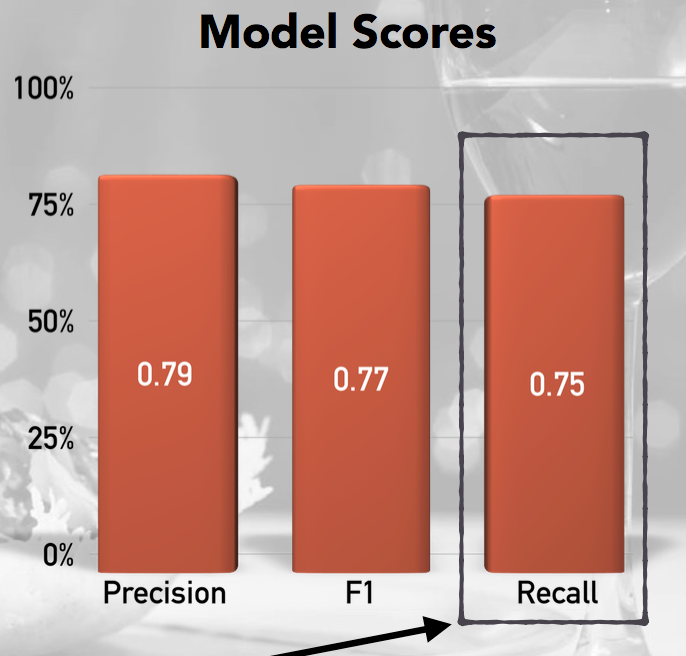
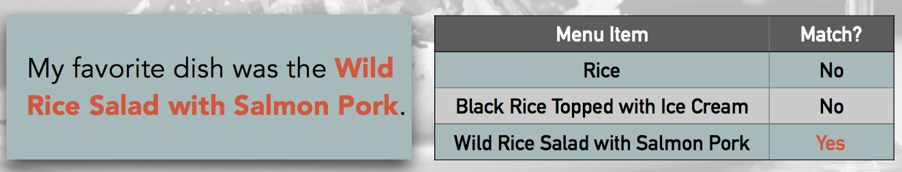
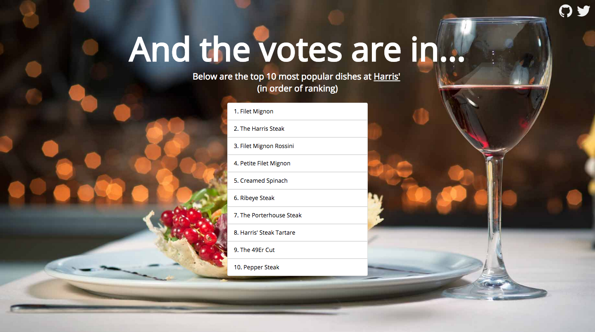

# Foodie Favorites

Check out the live app: www.foodiefavorites.co  
**_(If the above link doesn't work, I'm too cheap to still pay for hosting)_**

Foodie Favorites is a webapp created to help users make more informed decisions about what they eat when they go out to popular restaurants. It uses Natural Language Processing to classify food mentions in Yelp reviews and subsequently matches those mentions to menu items to help users find out what dishes are most popular.

## Inspiration
When going out to eat at a nice restaurant in the city, I frequently see people browsing their phones looking at Yelp reviews and pictures, frantically trying to make a decision about what to order before their waiter gets back to the table. Instead of wasting all that time, what if there was a service that would quickly and accurately tell you what is popular without having to fish for it yourself. So that's what I set out to do by creating Foodie Favorites.

## Data Sourcing
The Yelp data that I needed was a little tricky to get, while they have an easily accessible API, it's very limiting in what data it provides. I needed lots of reviews and restaurant menus, neither of which was readily available through the API. Yelp does provide some amazingly rich academic datasets as part of its Yelp Dataset Challenge. I used a slightly older one, which contained well over 200,000 reviews from 2006-2012 for restaurants in Chicago, Boston, Los Angeles, Washington D.C., Philadelphia, New York, and San Francisco. Since the data files are somewhat large (>100 mb), I have provided them in a [zip file](data/Yelp_data_json_2006_2012.zip).

## Data Processing
To keep the scope of this project feasible to something that could be accomplished in two weeks, I did not use or analyze sentiment for my model. Since I didn't want to just do a popularity ranking of what dishes appear the most often (this is what Yelp highlights does), I limited my project to only looking at positive reviews (>= 4 stars). If time permits in the future, I would definitely considering adding sentiment to provide even more accurate results.

## Modeling

### Part 1 - Named Entity Recognition
To frame this as a data science problem, there were two issues at hand, the first of which was determining whether or not a word was considered "food". To do this, I used a <b>Conditional Random Field</b> (CRF) algorithm to locate and classify text as "food" entities - a type of [named-entity recognition](https://en.wikipedia.org/wiki/Named-entity_recognition). A CRF uses text featurization like part of speech, is it a capital, is it a title, as well as features about adjacent words, in order to make a classification.

#### Example of perfect classification in a review

#### Text Featurization

#### Model Scoring
Below are the model scores, the most important of which is <b>recall</b>. I altered my scoring method to look at an entire sentence and check if my prediction found at least 1 "FOOD" classification, if so, it was considered a true positive.

0.75 says that I was able to accurately classify sentences that contained "FOOD" 75% of the time. While I may be able to improve the model with some additional feature engineering and parameter tweaking, I've found that if I have a fairly large number of reviews (~150 or more), the results are still pretty good.

### Part 2 - String Matching
After I had completed classifying text as "FOOD" or "NOT FOOD", the next task was to match the food mentions to menu items. To do this I used a combination of Levenschtein distance methods and thresholds that would keep the false positives to a minimum.

<b>Methods:</b>
* Partial String Ratio
* Token Set Ratio

#### Example of perfect string matching

## Web Application
For each restaurant in the dataset, I ran my finalized model on all the reviews and then performed the string matching between the predicted food mentions and the menu to create a counter of popular items. I then loaded this counter along with the restaurant's info into a PostgreSQL database.

All of this was done on AWS so that I could easily provide it as a web based application for anyone that was interested. I used Flask and Bootstrap to create the front-end, again, the link is at the top of this page. Below is an example of what the output looks like - up to 10 of the most popular menu items at the specified restaurant are provided.

## Tools

<b>Modeling/Processing:</b>
* python
  * numpy
  * pandas
  * scikit learn
  * sklearn_crfsuite
  * cPickle
* bash

<b>Database:</b>
* psycopg2
* PostgreSQL

<b>Feature Engineering:</b>
* NLTK
* regex

<b>Version Control:</b>
* git
* markdown

<b>Web App:</b>
* flask
* bootstrap
* html
* css

<b>Web Hosting:</b>
* Amazon EC2

